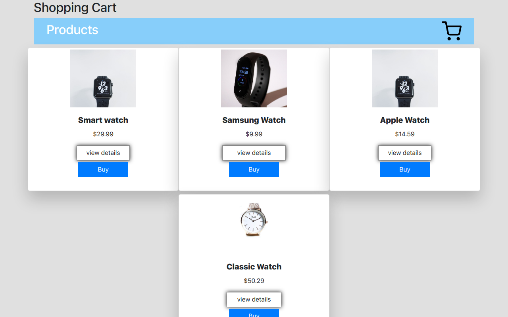

# A Shopping cart App 
A  single page react based web app made with reaactJS context-apiand hooks

## Tech stack
1.React Hooks
2.Context Api
3.Reducers

In the project directory, you can run:

### `npm start`

Runs the app in the development mode.\
Open [http://localhost:3000](http://localhost:3000) to view it in your browser.

